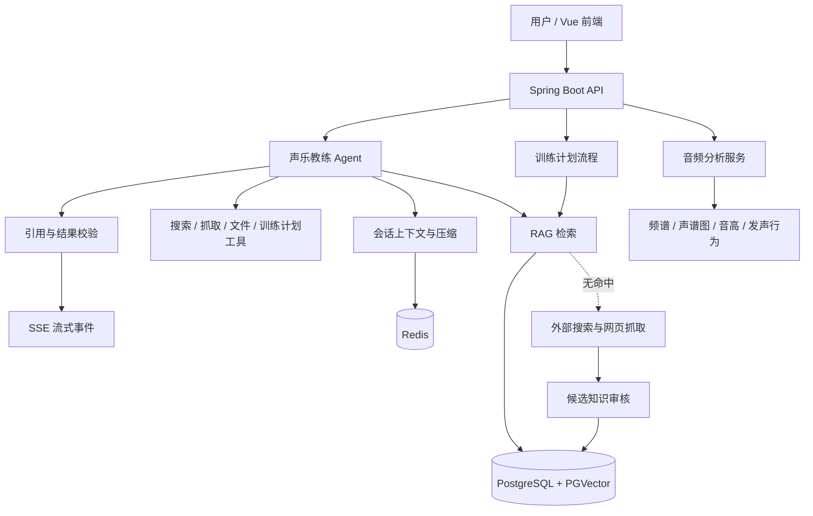

# Aoding Agent

一个面向流行演唱学习的 AI 应用后端，一个应用 Java AI 工程能力的完整项目。

本项目是基于真实“声乐爱好者教学”的垂直场景，完整实现了 Agent、RAG、工具调用、流式会话、音频分析、知识审核和离线评测等能力。
同样地，经过定制化修改和二次开发，它也可以适配各个不同垂类领域。

## 适合谁

- 想了解 Java 项目如何落地 LLM 应用的人；
- 想学习 Spring AI、RAG 和 Agent 工程实践的人；
- 正在准备 AI 应用开发、AI Agent 或 Java 后端岗位的人；
- 关注流行演唱声乐教学、音频分析、领域知识库和 AI 产品工程化的人。

## 这个项目能帮你做什么？

✅ 面试加分项：拥有一个真实完整的Agent项目，不再只是CRUD和背面试题

✅ 技术栈齐全：RAG全链路、Prompt 与上下文工程、ToolCalling、Agent记忆、Agent Eval一应俱全

✅ 学习参考：代码有详细注释，架构文档有图文说明

## 项目简介

用户可以通过对话询问歌唱技巧、发声问题和歌曲练习方法，也可以提交训练目标或演唱音频，获得结构化的训练计划和分析结果。

项目重点解决三个问题：

- 如何让 Agent 基于领域知识回答，而不是只依赖模型记忆；
- 如何让 Agent 在长任务、复杂任务和取消场景下仍然可控；
- 如何通过确定性校验和离线评测，优化Agent的回答质量，避免“看起来合理但实际上不可靠”的回答。

## 一次请求如何完成

以“我想学习《晴天》，帮我制定一个练习计划”为例：

```text
用户提交目标和约束
        ↓
输入分类与参数校验
        ↓
从声乐知识库检索歌曲、音区、气息和训练建议
        ↓
Agent 根据检索结果调用训练计划工具
        ↓
结构化生成阶段目标、每日训练项和参考资料
        ↓
确定性校验：格式、约束、引用是否有效
        ↓
通过 SSE 返回结果，必要时保存会话上下文
```

如果内部知识库没有合适内容，Agent 可以搜索和抓取外部资料，将其保存为候选知识。候选内容不会直接进入正式知识库，必须经过审核并成功写入向量库后才会生效。

## 项目结构

```text
backend/
├── src/main/java/com/sunyin/aodingagent/  # Spring Boot 后端源码
├── src/main/resources/document/           # 可公开的内置示例知识
├── src/test/                              # 单元测试、集成测试和离线评测
├── Dockerfile
├── mvnw.cmd
└── pom.xml

frontend/
├── src/                    # Vue 前端源码
├── Dockerfile
├── nginx.conf              # 静态资源服务和后端 API 代理
└── package.json

scripts/
└── init-knowledge.ps1      # 初始化内部知识库

searxng/
└── settings.yml            # SearXNG 本地配置

docker-compose.yml          # 前端、后端及基础设施服务编排
.env.example                # 环境变量模板
```

## 系统架构



## 核心功能

### 1. 声乐教练 Agent

基于 Spring AI 和工具调用实现声乐场景 Agent，支持：

- 歌曲演唱技巧、音区、气息、换声和发声问题咨询；
- 根据用户水平和目标给出分阶段练习建议；
- 返回实际参与生成的参考资料，减少凭空引用；
- 对不适合直接回答的内容进行边界提醒。

### 2. RAG 知识库

知识库采用 Markdown 作为可读、可维护的知识源，经过结构切分和 Token 切分后写入 PGVector。

- 内置歌手、歌曲和流行演唱知识；
- DashScope Embedding 生成向量；
- PGVector 保存和检索知识片段；
- 相似度阈值过滤低相关内容；
- 记录检索结果、使用的文档 ID 和引用信息；
- 通过 Recall@K、MRR 等指标进行检索回归。

### 3. 候选知识审核

当内部知识不足时，系统可以搜索和抓取外部网页，并保存为候选 Markdown。

```text
外部搜索与抓取
        ↓
候选知识文件
        ↓
人工预览、核验来源
        ↓
批准 / 拒绝
        ↓
批准后切分并写入 PGVector
```

候选知识与正式知识库分离。向量写入失败时不会把候选误标记为已发布，重复审核也不会重复发布。

### 4. 训练计划生成

用户提交训练目标、当前水平和约束后，系统生成：

- 阶段目标；
- 每日训练项目；
- 训练重点与注意事项；
- 与知识库结果对应的参考资料；
- 可下载的 PDF 计划。

训练计划经过输入校验、一次修复和确定性结果校验，避免模型输出缺少字段、违反约束或伪造引用。

### 5. 音频分析

后端不保存仓库内的个人音频样例，运行时接收用户上传的音频并进行分析：

- 音频解码与 PCM 处理；
- 频谱和声谱图；
- 音高轨迹；
- 高音片段识别；
- 发声行为和音色特征分析；

分析结果用于辅助训练建议，不代表真实声压级，也不用于医疗诊断。

### 6. 流式会话与可靠性

- SSE 流式返回 Agent 事件；
- 心跳避免长连接被中间网络设备关闭；
- 使用 `requestId` 和 `lastEventId` 支持进程内 SSE 断线重连与事件重放；
- 支持取消正在执行的模型或 Agent 任务；
- Redis 保存会话上下文和用户画像；
- 对历史上下文进行 Token 预算和压缩，避免长对话无限膨胀。

### 7. 研究流程与评测

研究型任务包含搜索、抓取、任务规划、结果校验、引用累积和结构化交付。项目同时保留固定评测集，用于检查：

- 任务是否完成；
- 回答是否切题；
- 引用是否真实使用；
- 安全边界是否生效；
- RAG 是否召回正确文档；
- 训练计划是否满足输入约束。


| 方向 | 项目具体实现                                 | 状态 |
| -- |----------------------------------------| --- |
| Spring AI / 大模型调用 | ChatModel、Embedding、工具回调、上下文组装         | 已实现 |
| Agent / ReAct / Tool Calling | Agent 循环、工具注册、工具输出限制、终止控制              | 已实现 |
| RAG 全链路 | Markdown 切分、Embedding、PGVector、阈值过滤、引用 | 已实现 |
| Prompt 与上下文工程 | 上下文预算、压缩、结构化输出、结果修复                    | 已实现 |
| SSE 与并发可靠性 | Reactor Flux、心跳、进程内断线重连、事件重放、取消、虚拟线程 | 已实现（单实例） |
| Redis 与持久化 | 会话、用户画像和上下文存储                          | 已实现 |
| 音频算法工程 | FFT、频谱、音高轨迹、发声行为分析                     | 已实现 |
| AI 效果评测 | Golden Case、Recall@K、MRR、引用有效性         | 已实现，持续优化中 |
| 安全与治理 | 候选知识审核、路径边界、上传限制、引用白名单                 | 部分实现，持续优化中 |


## 技术栈

- Java 21
- Spring Boot 3.5
- Spring AI Alibaba / Spring AI OpenAI 兼容接口
- DashScope Chat 与 Embedding
- PostgreSQL + PGVector
- Redis
- Reactor Flux + Server-Sent Events
- Java Virtual Threads
- Jsoup 网页抓取
- JAVE / FFmpeg 音频解码
- iText PDF 导出
- JUnit 5、Spring Boot Test

## 快速启动

### 前置条件

- Git（可选，也可以直接从 GitHub 下载 ZIP）；
- Docker Desktop，并确保 Docker Engine 已启动；
- 可用的阿里云百炼平台 DashScope API Key，官网：https://bailian.console.aliyun.com/；
- 如需使用 SearchAPI 作为联网搜索回退，再准备 SearchAPI Key，官网：https://www.searchapi.io/。

不需要在本机单独安装 JDK、Maven、Node.js、PostgreSQL、PGVector、Redis 或 SearXNG，Docker Compose 会统一创建和运行这些服务。

### 首次准备

在项目根目录执行：

```powershell
Copy-Item .env.example .env
notepad .env
```

至少需要在 `.env` 中填写：

```dotenv
AI_DASHSCOPE_API_KEY=你的百炼Key
```

如需启用 SearchAPI 回退，再填写：

```dotenv
SEARCH_API_KEY=你的SearchAPI_Key
```

SearXNG 由 Compose 在本地运行，不需要 API Key。

### 首次启动

```powershell
docker compose up -d --build
```

该命令会构建并启动前端、后端、PostgreSQL + PGVector、Redis 和 SearXNG。

首次构建需要下载 Docker 镜像以及 Maven、npm 依赖，耗时取决于网络环境。

### 后续启动与关闭

后续启动：

```powershell
docker compose up -d
```

关闭：

```powershell
docker compose down
```

`docker compose down` 不会删除数据库数据。如需连同数据库和 Redis 数据一起清空，执行：

```powershell
docker compose down -v
```

### 初始化知识库

首次启动容器后，需要单独执行一次内部知识库初始化脚本：

```powershell
.\scripts\init-knowledge.ps1
```

该脚本会等待后端就绪，然后读取内置 Markdown 文档、调用 DashScope Embedding API 生成向量，并写入 PostgreSQL + PGVector。

以后正常启动不需要重复初始化。
只有当您新增或更新了部分 `backend/src/main/resources/document/` 中的文档，且认为需要更新时，才需要重新构建后端并再次初始化。后端会删除数据库中同名文件的全部旧向量块，进行重新切分、生成 Embedding，并分批写入 PGVector：

```powershell
docker compose up -d --build backend
.\scripts\init-knowledge.ps1
```

### 访问地址

启动完成后访问：

- 前端：<http://localhost:8080>；
- 健康检查：<http://localhost:8080/api/health>。

如果端口被占用，可以在 `.env` 中修改 `FRONTEND_PORT`。

## Docker 部署

仓库根目录提供 `docker-compose.yml`，用于统一构建和启动以下服务：

- Vue + Nginx 前端；
- Spring Boot 后端；
- PostgreSQL + PGVector；
- Redis；
- SearXNG。

按照“快速启动”章节准备 `.env` 后，在仓库根目录执行：

```powershell
docker compose up -d --build
```

Compose 只将前端端口映射到本机，默认通过 <http://localhost:8080> 访问。前端 Nginx 会把 `/api/**` 请求转发到内部的后端容器；PostgreSQL、Redis、SearXNG 和后端端口不会暴露到本机。

停止服务：

```powershell
docker compose down
```

PostgreSQL、Redis 和候选知识使用 Docker 数据卷保存，普通的 `docker compose down` 不会删除数据。如需清空所有本地演示数据：

```powershell
docker compose down -v
```

后端容器默认关闭 Swagger、OpenAPI 和 Knife4j。该 Compose 配置用于本地演示和体验，不代表已经完成公网生产环境所需的认证、限流、HTTPS、告警和密钥管理。

## 验证与评测

不访问模型、网络、PostgreSQL 或 Redis 的训练计划评测：

```powershell
cd backend
.\mvnw.cmd -o -Dtest=TrainingPlanEvaluationTest test
```

报告输出到：

```text
target/evaluation/training-plan-metrics.json
```

运行完整测试：

```powershell
cd backend
.\mvnw.cmd test
```


## 开源说明

项目适合作为 Java AI 应用工程案例开源。公开仓库建议只保留安全示例和通用实现，完整知识可以作为部署时的私有数据维护。

当前版本的正式知识加载器读取 classpath 中的 Markdown，因此新增线上知识通常需要：

```text
补充安全文档 → 重新构建镜像 → 部署 → 初始化知识库
```

后续可以增加外部私有 Markdown 目录或增量导入机制，使知识更新不必重新发布代码。候选知识目录也不能直接当作正式知识目录使用，仍需经过审核。

知识文档可能由 AI 辅助生成并经过人工整理，内容仅供学习参考。开源前应确认文档没有歌词全文、课程原文、网页整段复制内容或个人信息，并补充明确的 LICENSE 文件。

## 当前边界

- 当前项目是模块化单体，不是微服务平台；
- `/api/admin/**` 尚未内置管理员身份认证，部署上线必须由网关或应用安全配置限制；
- 音频分析用于训练辅助，不是医疗诊断或专业录音棚测量；
- 评测结果用于回归和质量观察，不等同于线上真实用户效果或生产 SLA；
- 模型、数据库、Redis 和搜索服务均属于外部运行依赖。
